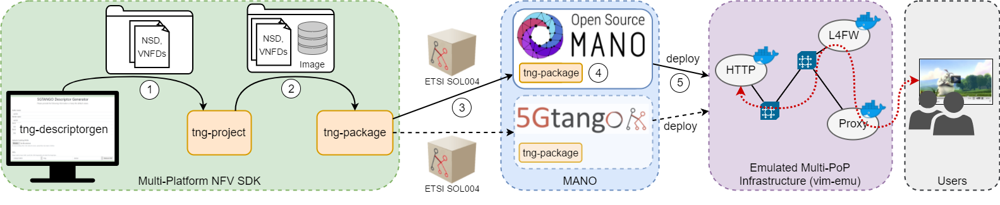

# Multi-Platform NFV SDK Demo

Showing the end-to-end workflow from descriptor generation, creating a project and packaging it, to on-boarding it to OSM (or possible Tango) and running the uploaded service on the `vim-emu` emulator.

Example service: [Simple video streaming network service](https://github.com/sonata-nfv/son-tutorials/tree/master/upb-emulator-mano-integration-demo) ([OSM files](https://github.com/sonata-nfv/son-tutorials/tree/master/upb-emulator-mano-integration-demo/osm/pkggen))

## Installation

* Descriptor generator
  * `git clone https://github.com/sonata-nfv/tng-sdk-descriptorgen.git`
* Project:
  * `pip install git+https://github.com/sonata-nfv/tng-sdk-project.git`
  * Setup the workspace: `tng-wks`
* Packager:
  * `pip install git+https://github.com/sonata-nfv/tng-sdk-package.git`
* OSM client installation and configuration: See [wiki](https://github.com/CN-UPB/demo-multi-platform-nfv-sdk/wiki/Demo-setup:-tng-sdk-packager)
* VIM emulator `vim-emu`: See manual installation on [OSM website](https://osm.etsi.org/wikipub/index.php/VIM_emulator)

## Demo steps

1. Generate OSM descriptors using tng-sdk-descriptorgen and download the generated descriptors with `project.yaml` (GUI)
2. Unzip the downloaded `descriptors.zip` and check the generated project with `tng-prj -p descriptors --status` (CLI)
3. Package the project with `tng-pkg -p descriptors` (CLI)
4. Upload the package to OSM (or theoretically to 5GTANGO)
5. Unpackage the package and trigger OSM instantiate (GUI?)
6. Run the service on the emulator and show the running service on the emulator's dashboard (GUI)
7. Show the streamed video (CatTube on Cromium browser)

